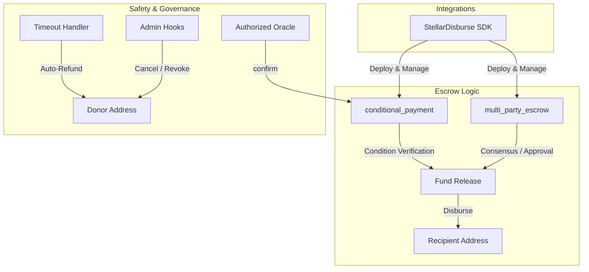

# StellarDisburse Contracts: Conditional Aid Escrow

[](https://www.drips.network/wave)
[](https://soroban.stellar.org/)

**The smart contract foundation for outcome-based aid delivery. Programmable conditional payments and multi-party escrows for NGOs and governments built on Soroban.**

---

# 🛡️ Technical Overview

`stellardisburse-contracts` provides the on-chain security layer for the StellarDisburse ecosystem. It enables organizations to move beyond simple transfers by codifying release conditions, timeouts, and multi-party dispute resolution directly into the Stellar ledger. This ensures that aid reaches the right hands only when verified impact or agreement is achieved.

### Core Contract Primitives:
*   **`conditional_payment`**: A high-fidelity escrow contract that releases funds only when an authorized oracle address calls `confirm(condition_id)`.
*   **`multi-party-escrow`**: A flexible governance contract supporting unanimous approval, majority consensus, or single-designated arbiter release patterns.
*   **Safety Hooks:** Built-in support for donor-initiated cancellations and automatic timeout-based refunds to prevent fund loss.

---

# 🏗️ Internal Architecture

The contracts are designed to be used as standalone modules or integrated into larger disbursement workflows managed by the `stellardisburse-sdk`.



---

# 📋 Contract Specifications

The following primitives define the core utility of the StellarDisburse protocol.

| Contract | Primary Responsibility | Technical Pattern |
| :--- | :--- | :--- |
| **`conditional_payment`** | Releasing held funds when an authorized oracle confirms a specific condition. | Oracle-triggered state transition with timeout-based refund logic. |
| **`multi-party-escrow`** | Managing funds with configurable release thresholds: unanimous, majority, or arbiter. | Configurable consensus model with multi-party auth tracking. |

---

# 📂 Repository Structure

```text
stellardisburse-contracts/
├── contracts/
│   ├── conditional_payment/ # Oracle-based conditional escrow
│   └── multi_party_escrow/  # Consensus-based multi-party escrow
├── tests/                  # Integration tests for timeout and confirm paths
├── Cargo.toml              # Workspace and dependency config
└── README.md               # You are here
```

---

# 🛠️ Development & Contributing

We welcome contributions from Soroban smart contract developers interested in humanitarian and social impact.

### Local Setup
1. **Clone the Repo:** `git clone https://github.com/stellardisburse/stellardisburse-contracts.git`
2. **Build:** `stellar contract build`
3. **Test:** `cargo test`

### Contributor Path (Wave 5)
*   **Soroban Developers:** Help us implement the core `conditional_payment` and `multi-party-escrow` logic.
*   **QA Engineers:** Write comprehensive test suites for timeout and confirmation paths, ensuring no unauthorized release is possible.
*   **Security Researchers:** Conduct a cross-project audit using **SoroGuard** and document any findings.
*   **Technical Writers:** Document the contract IDs and deployment parameters for testnet use.

---

# 📄 License

This project is licensed under the **Apache License 2.0**.
